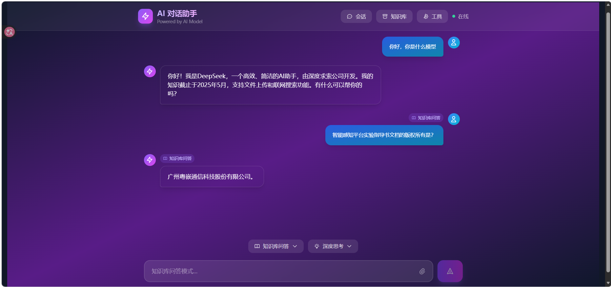
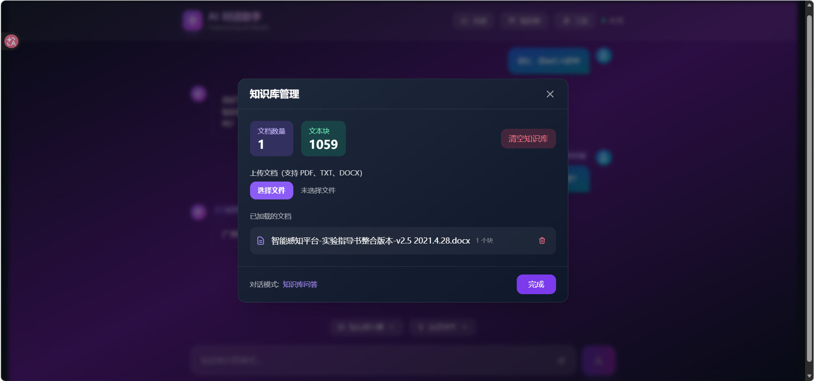

# LLM AI Agent 项目

一个基于 LangChain 和 React 的智能问答系统，支持本地模型和云端 API。

## 技术栈

### 前端
- **React 19** - UI 框架
- **Vite** - 构建工具
- **Tailwind CSS** - 样式框架
- **React Markdown** - Markdown 渲染

### 后端 / AI 服务
- **LangChain** - AI 应用开发框架
- **LangChain OpenAI** - OpenAI 兼容接口
- **ChromaDB** - 向量数据库
- **Sentence Transformers** - 文本嵌入模型
- **Anthropic SDK** - Claude API 支持
- **OpenAI SDK** - GPT API 支持

### 本地模型
- **Torch** - PyTorch 深度学习框架
- **Hugging Face Hub** - 模型托管

## 项目结构

```
├── src/              # React 前端源码
├── public/           # 静态资源
├── langchain_service.py   # LangChain 服务
├── local_model_service.py  # 本地模型服务
├── session_memory.py       # 会话记忆管理
├── tools/            # AI 工具函数
├── rag/              # RAG 相关代码
├── vector_store/     # 向量存储
├── data/             # 知识库数据
└── output/           # 输出文件
```

## 快速开始

### 前端

```bash
npm install
npm run dev
```

### 后端依赖

```bash
pip install -r requirements.txt
```

## 运行结果





## 功能特性

- 支持 Claude / GPT 等主流 LLM
- 本地向量检索增强生成 (RAG)
- 多轮对话记忆
- 知识库问答
- 工具调用能力
