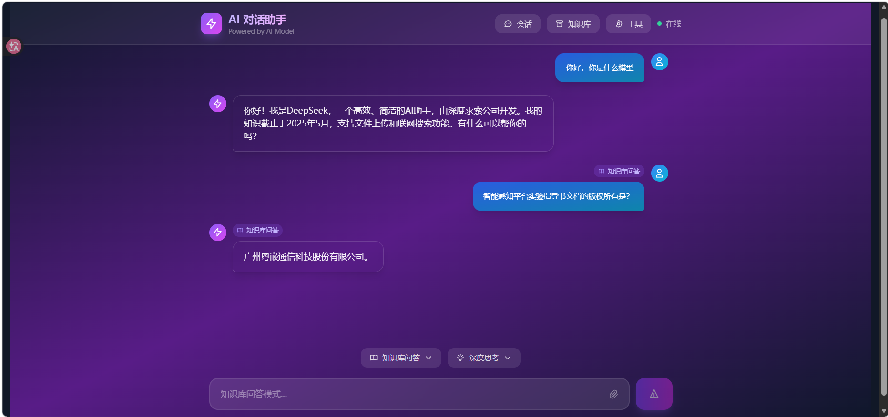
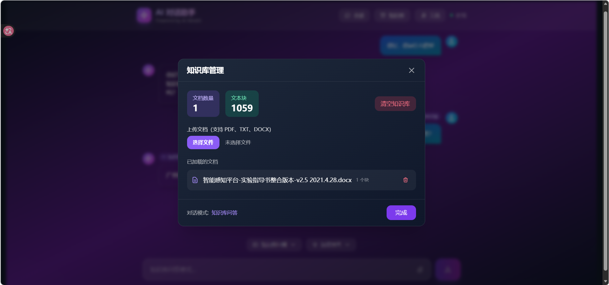

# LLM AI Agent 项目

一个基于 LangChain 和 React 的智能问答系统，支持本地模型和云端 API。

## 技术栈

### 前端
- **React 19** - UI 框架
- **Vite** - 构建工具
- **Tailwind CSS** - 样式框架
- **React Markdown** - Markdown 渲染

### 后端 / AI 服务
- **LangChain** - AI 应用开发框架
- **LangChain OpenAI** - OpenAI 兼容接口
- **ChromaDB** - 向量数据库
- **Sentence Transformers** - 文本嵌入模型
- **Anthropic SDK** - Claude API 支持
- **OpenAI SDK** - GPT API 支持

### 本地模型
- **Torch** - PyTorch 深度学习框架
- **Hugging Face Hub** - 模型托管

## 项目结构

```
├── src/
│   ├── app/                 # 应用入口、壳层和全局状态
│   ├── features/            # 按业务域隔离的任务、会话、知识库、工具、技能
│   ├── shared/              # 跨业务复用的 UI 原子组件
│   ├── services/
│   │   ├── domains/         # Agent / Chat / RAG / Tools / Sessions / Models API
│   │   └── http/            # fetch、JSON、SSE 通信基础设施
│   └── styles/              # 设计令牌和全局样式
├── backend/
│   ├── app.py               # FastAPI 组合入口和兼容路由
│   ├── config.py            # 模型、路径、CORS 等运行配置
│   ├── services/            # 任务编排、LLM、本地模型、RAG、会话服务
│   └── routes/              # HTTP 路由扩展点
├── langchain_service.py     # 旧启动入口兼容门面
├── local_model_service.py   # 本地模型兼容导入
├── session_memory.py        # 会话存储兼容导入
├── tools/                   # AI 工具函数和注册中心
├── rag/                     # RAG 基础组件和向量存储
├── mcp_client/              # MCP 客户端与动态工具发现
├── vector_store/            # 向量索引运行数据
└── data/                    # SQLite 会话数据
```

## 快速开始

### 前端

```bash
npm install
npm run dev
```

### 后端依赖

```bash
pip install -r requirements.txt
python -m uvicorn backend.app:app --reload --port 8000
```

旧命令 `python -m uvicorn langchain_service:app --reload --port 8000` 仍然可用。

## 运行结果





## 功能特性

- 支持 Claude / GPT 等主流 LLM
- 本地向量检索增强生成 (RAG)
- 多轮对话记忆
- 知识库问答
- 工具调用能力
- Agent 工作模式：Ask / Plan / Craft
- 任务时间线、工作区、技能开关和危险操作审批
- 任务与会话通过 SSE 事件流保持前后端状态一致

## 多模态 RAG 资源

知识库入库时会提取 PDF、DOCX、PPTX 和 XLSX 中可识别的图片及嵌入附件，资源元数据保存在 `vector_store/resources.json`，文件保存在 `rag_resources/`。资源通过 `/api/rag/resource/{resource_id}` 访问，旧的文本检索接口仍然可用。

## MCP 客户端

安装依赖后，将 `mcp_servers.example.json` 复制为本地配置文件，并通过环境变量启用：

```bash
pip install -r requirements.txt
set MCP_CONFIG_FILE=D:\path\to\mcp_servers.json
```

支持 `stdio`、`sse` 和 Streamable HTTP（配置值为 `http`）。HTTP/SSE 认证头和 stdio 环境变量只从 `header_env`/`env_from` 指定的环境变量读取。服务启动后，MCP 工具会以 `mcp__服务名__工具名` 的形式注册到现有 ToolAgent，并继续使用原有的确认机制。
