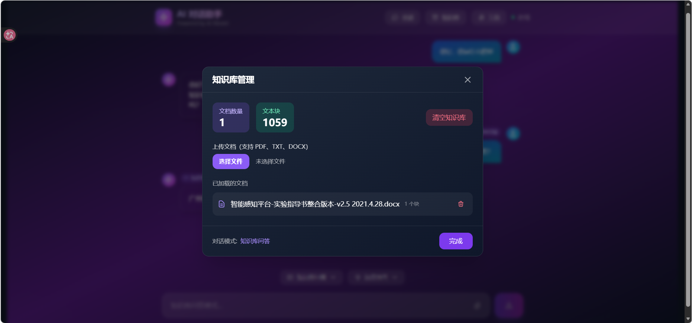

# LLM AI Agent 项目 / Agent 工作台

> 一个基于 FastAPI、LangChain 和 React 的本地文件 Agent 助手工作台。支持在线模型、本地模型、RAG 知识库、工具调用、MCP 动态工具发现、任务时间线与危险操作审批。

---

## 目录

- [项目简介](#项目简介)
- [核心功能](#核心功能)
- [技术栈](#技术栈)
- [目录结构](#目录结构)
- [快速开始](#快速开始)
- [环境变量与配置](#环境变量与配置)
- [后端架构](#后端架构)
- [后端 API 接口](#后端-api-接口)
- [前端架构](#前端架构)
- [状态管理](#状态管理)
- [API 调用层](#api-调用层)
- [工具系统](#工具系统)
- [MCP 客户端与注册机制](#mcp-客户端与注册机制)
- [Agent 编排流程](#agent-编排流程)
- [RAG 知识库](#rag-知识库)
- [会话与记忆](#会话与记忆)
- [流式输出机制](#流式输出机制)
- [任务与沙箱](#任务与沙箱)
- [可观测性](#可观测性)
- [开发工作流](#开发工作流)
- [已知问题](#已知问题)

---

## 项目简介

前端定位为「本地文件 Agent 助手工作台」，页面标题为 `Agent 工作台`，入口为 `src/main.jsx`。

后端提供 OpenAI 兼容的在线模型调用、本地模型加载、RAG 知识库、工具调用、MCP 动态发现、任务编排与审批流。

---

## 核心功能

- 支持 Claude / GPT / ModelScope / SiliconFlow 等 OpenAI 兼容接口
- 支持本地模型加载与在线 API 切换
- 本地向量检索增强生成（RAG）
- 多轮对话记忆
- 知识库问答与多模态资源管理
- 工具调用能力
- MCP 客户端与动态工具发现
- Agent 工作模式：Ask / Plan / Craft
- 任务时间线、工作区、技能开关和危险操作审批
- 任务与会话通过 SSE 事件流保持前后端状态一致
- Langfuse 可观测性接入
- Mem0 结构化记忆接入
- E2B / 本地沙箱执行

---

## 技术栈

### 前端

| 分类 | 组件 |
|---|---|
| 框架 | React 19 |
| 构建 | Vite 8 |
| 样式 | Tailwind CSS 3 |
| Markdown | React Markdown + remark-gfm |
| SDK | OpenAI SDK / Anthropic SDK |

### 后端

| 分类 | 组件 |
|---|---|
| Web | FastAPI + Uvicorn |
| LLM 框架 | LangChain / LangChain OpenAI / LangChain Community |
| 向量库 | ChromaDB / FAISS |
| 嵌入模型 | Sentence Transformers / Hugging Face Hub |
| 深度学习 | PyTorch |
| LLM SDK | Anthropic SDK / OpenAI SDK |
| 中文 NLP | jieba |
| 数据库 | PyMySQL |
| MCP | MCP Python SDK |
| 可观测性 | Langfuse |
| 沙箱 | E2B Code Interpreter |
| 结构化记忆 | Mem0 + Qdrant Client |
| 配置 | python-dotenv |

---

## 目录结构

```text
.
├── src/                         # React 前端
│   ├── app/
│   │   ├── App.jsx              # Provider 嵌套
│   │   ├── shell/               # AppShell / TopBar
│   │   └── state/               # AppContext / AppStore
│   ├── capabilities/            # MCP / Tools Provider
│   ├── features/
│   │   ├── activity/            # ApprovalQueue / FileLogPanel / TrashPanel
│   │   ├── knowledge-base/      # KnowledgeBasePanel
│   │   ├── sessions/            # SessionPanel
│   │   ├── tasks/               # TaskList / TaskTimeline / TaskComposer / TimelineStep / ApprovalCard / DiffPreview
│   │   └── workspace/           # WorkspacePanel
│   ├── services/
│   │   ├── api.js               # 兼容 barrel
│   │   ├── domains/             # agent / chat / rag / tools / sessions / models
│   │   └── http/                # fetch / SSE 基础设施
│   ├── shared/                  # capabilityUtils / ui
│   └── styles/                  # tokens.css
│
├── backend/                     # FastAPI 后端
│   ├── app.py                   # 应用装配层
│   ├── config.py                # 运行配置
│   ├── routes/                  # HTTP 路由
│   └── services/                # LLM / 本地模型 / RAG / 记忆 / 提示词 / 沙箱 / 任务服务
│
├── tools/                       # 工具定义、加载器、Agent、编排器、MCP 发现
│   ├── agent.py                 # ToolAgent
│   ├── loader.py                # 触发工具注册
│   ├── mcp_discovery.py         # search_and_connect_mcp
│   ├── nlp_processor.py         # jieba 预处理
│   ├── guidance/extractor.py    # MCP 引导提取
│   ├── idempotency/classifier.py
│   ├── orchestration/           # core / intent_router / prompt / state / tool_shortlister / validator
│   ├── semantics/               # failure / tags
│   └── tools_def/               # data / file / knowledge / mysql / network / sandbox / time
│
├── rag/                         # 文档解析、切分、检索、向量存储、资源管理
├── mcp_client/                  # MCP 客户端、worker、registry、动态存储
├── vector_store/                # FAISS 索引与资源元数据
├── rag_resources/               # RAG 多模态资源文件
├── data/                        # SQLite 会话数据 + MCP filesystem 根目录
├── logs/                        # 日志
├── dist/                        # 前端构建产物
├── langchain_service.py         # 旧启动入口兼容门面
├── local_model_service.py       # 本地模型兼容导入
├── session_memory.py            # 会话存储兼容导入
├── mcp_servers.json             # MCP 服务配置
├── package.json
├── requirements.txt
└── vite.config.js
```

---

## 快速开始

### 1. 后端

```bash
python -m venv .venv
.venv\Scripts\activate
pip install -r requirements.txt

# 若启动报 FastAPI / Uvicorn 缺失（当前 requirements.txt 未显式列出）：
pip install fastapi "uvicorn[standard]"

python -m uvicorn backend.app:app --reload --port 8000
```

旧入口仍兼容：

```bash
python -m uvicorn langchain_service:app --reload --port 8000
```

### 2. 前端

```bash
npm install
npm run dev
```

默认访问 `http://localhost:5173`。

### 3. 前端脚本

```bash
npm run dev       # 开发
npm run build     # 构建
npm run lint      # ESLint
npm run preview   # 预览构建产物
```

---

## 环境变量与配置

项目从项目根目录的 `.env` 加载配置。

| 变量 | 用途 | 默认 |
|---|---|---|
| `MODESCOPE_API_KEY` | ModelScope API Key | — |
| `SILICONFLOW_API_KEY` | SiliconFlow API Key | — |
| `LOCAL_MODEL_PATH` | 本地模型路径 | — |
| `DEVICE` | 本地模型设备 | `cpu` |
| `MCP_CONFIG_FILE` | MCP 配置文件路径 | `<项目根>/mcp_servers.json` |
| `HF_ENDPOINT` | Hugging Face 镜像 | `https://hf-mirror.com` |
| `TRANSFORMERS_OFFLINE` | 离线加载 | 冲突，见下方注释 |
| `HF_HUB_CACHE` / `HF_HOME` | HF 缓存目录 | `<项目根>/models` |
| `LANGFUSE_ENABLED` | 启用 Langfuse | `true` |
| `LANGFUSE_PUBLIC_KEY` / `SECRET_KEY` | Langfuse 凭证 | — |
| `LANGFUSE_HOST` | Langfuse Host | `https://cloud.langfuse.com` |
| `MEM0_ENABLED` | 启用 Mem0 | `true` |
| `MEM0_API_KEY` / `MEM0_CONFIG` | Mem0 配置 | — |
| `SANDBOX_BACKEND` | 沙箱后端 | `local`（或 `e2b`） |
| `E2B_API_KEY` / `E2B_TEMPLATE` | E2B 配置 | — |
| `RAG_RESOURCE_DIR` | 资源目录 | `./rag_resources` |
| `RAG_RESOURCE_METADATA` | 资源元数据 | `./vector_store/resources.json` |
| `VITE_API_BASE_URL` | 前端后端地址 | `http://localhost:8000` |

示例 `.env`：

```dotenv
MODESCOPE_API_KEY=your_modelscope_key
SILICONFLOW_API_KEY=your_siliconflow_key

LOCAL_MODEL_PATH=
DEVICE=cpu

MCP_CONFIG_FILE=./mcp_servers.json

LANGFUSE_ENABLED=false
LANGFUSE_PUBLIC_KEY=
LANGFUSE_SECRET_KEY=
LANGFUSE_HOST=https://cloud.langfuse.com

MEM0_ENABLED=false
MEM0_API_KEY=
MEM0_CONFIG=

SANDBOX_BACKEND=local
E2B_API_KEY=
E2B_TEMPLATE=base
```

> **安全要求**：不要提交 `.env` 与真实 API Key。`backend/config.py` 中不应保留硬编码默认密钥。

### 关于 `TRANSFORMERS_OFFLINE` 的冲突

`backend/config.py` 设为 `'0'`，`rag/vector_store.py` 设为 `'1'`，两边都用 `os.environ.setdefault`。**谁先 import 谁生效**。`backend/app.py` 先 import `config`，因此实际生效值通常是 `'0'`（允许联网）。若希望默认离线，请在 `config.py` 里统一管理。

---

## 后端架构

`backend/app.py` 是**应用装配层**，不承载具体业务逻辑。

### 职责边界

```text
backend/app.py
  ├── 注册惰性加载模块（anthropic / langchain_openai / langchain_core / ...）
  ├── lifespan
  │     ├── init_langfuse()
  │     ├── init_mem0()
  │     ├── 加载 mcp_servers.json
  │     ├── 创建 MCPClientManager + MCPWorker + MCPManagerProxy
  │     ├── 注入 ToolAgent / mcp_discovery
  │     ├── preload_all_in_background()
  │     └── 后台预热 ToolShortlister
  ├── CORS 中间件
  ├── 服务工厂（全局单例）
  │     ├── get_tool_agent()
  │     ├── get_tool_shortlister()
  │     ├── get_local_rag_service()
  │     ├── get_agent_task_service()
  │     ├── get_llm()
  │     ├── get_multimodal_client()
  │     └── get_rag_service()
  └── 注册路由工厂
        health / tools / mcp / chat / rag / sessions / models / agent
```

### 分层约定

| 层 | 位置 | 职责 |
|---|---|---|
| 路由层 | `backend/routes/` | HTTP 入参解析、SSE 头、错误包装 |
| 服务层 | `backend/services/` | LLM、模型、RAG、记忆、提示词、沙箱、任务编排 |
| 能力层 | `tools/`、`rag/`、`mcp_client/` | 工具、RAG 组件、MCP 客户端 |
| 装配层 | `backend/app.py` | 单例、lifespan、路由注册 |

### 惰性加载

`backend/services/lazy_loader.py` 统一管理重模块。启动时只注册 loader，不立即 import：

```text
anthropic / langchain_openai / langchain_core /
langchain_text_splitters / langchain_huggingface / langchain_community
```

`ModelScopeLLM`、`MultimodalClient`、`RAGService` 的 `__init__` 也不加载重模块，真正的加载发生在首次调用时，由 FastAPI 在线程池执行，避免阻塞事件循环。

`GET /api/modules/status` 返回惰性模块的加载状态。

### 服务工厂（全局单例）

| 工厂 | 返回 |
|---|---|
| `get_tool_agent()` | `ToolAgent`，首次调用触发 `tools.loader.load_all_tools()` |
| `get_tool_shortlister()` | `ToolShortlister`，失败返回 `None` |
| `get_local_rag_service()` | `LocalRAGService` |
| `get_agent_task_service()` | `AgentTaskService`，注入全部 provider |
| `get_llm()` | `ModelScopeLLM` |
| `get_multimodal_client()` | `MultimodalClient` |
| `get_rag_service()` | legacy `RAGService` |

### 模型服务

#### `ModelScopeLLM`（`backend/services/llm.py`）

⚠️ **命名与实现不一致**：类名为 `ModelScopeLLM`，实际使用 `SILICONFLOW_API_KEY` / `SILICONFLOW_BASE_URL`。

- `__init__` 不加载 `langchain_openai`，只记录 `use_local`
- `use_local=False` 时首次 `generate` / `stream_generate` 调 `_ensure_llm()` 用 `ChatOpenAI` 连接 SiliconFlow
- `use_local=True` 时委托 `LocalModelService`
- `_convert_to_langchain` 惰性 import `langchain_core.messages`
- `_langchain_config` 从 `observability.get_callback_handler()` 拿 per-turn Langfuse handler
- 模式提示词：`quick` 简洁回答；`deep` 先"思考："再"答案："

#### `MultimodalClient`

- 惰性加载 `anthropic`
- `stream_analyze` 走 Anthropic Messages Stream，支持 `thinking_delta` 与 `text_delta`
- 模型名硬编码为 `deepseek-ai/DeepSeek-V4.1-Flash`
- base_url 指向 ModelScope，使用 `MODESCOPE_API_KEY`

#### `LocalModelService`（`backend/services/local_model.py`）

- 支持 ModelScope 与 HuggingFace 两种加载路径
- `stream_generate` 是"同步生成 + 逐字切片"，**非真正逐 token 流式**
- `get_local_model_service(config)` 是全局单例，首次调用即触发 `load_model()`
- `download_model_from_modelscope(model_name, local_dir)` 供 `/api/model/download`

### 两套 RAG 服务

| 服务 | 位置 | 存储 | 用途 |
|---|---|---|---|
| `RAGService`（legacy） | `backend/services/llm.py` | 内存 Chroma | `/api/rag/add`、`/api/rag/query` |
| `LocalRAGService` | `backend/services/local_rag.py` | FAISS + 资源目录 | 其余 `/api/rag/*` 与 Agent 知识工具 |

### 模型切换

`_switch_model_source(source)`：

```text
online → MODEL_SOURCE = ONLINE，立即生效
local  → MODEL_SOURCE = LOCAL，并尝试加载本地模型
```

`MODEL_SOURCE` 是模块级全局变量，切换后新建的实例读取新值；已存在的实例不会自动切换。

---

## 后端 API 接口

### 健康检查

| 方法 | 路径 | 说明 |
|---|---|---|
| GET | `/` | 运行状态 |
| GET | `/api/modules/status` | 惰性模块加载状态 |

### 对话与多模态

| 方法 | 路径 | 入参 | 说明 |
|---|---|---|---|
| POST | `/api/chat` | form: `message`, `history` | SSE 流式对话 |
| POST | `/api/chat/stream` | JSON: `messages` | SSE 流式对话（消息数组） |
| POST | `/api/chat/rag` | form: `message`, `history`, `use_rag`, `top_k`, `mode` | 先检索 RAG 再拼 system prompt |
| POST | `/api/analyze` | form: `message`, `files` | 多模态分析，文件转 base64 |

### Legacy RAG

| 方法 | 路径 | 说明 |
|---|---|---|
| POST | `/api/rag/add` | 向内存 Chroma 添加文本 |
| POST | `/api/rag/query` | 同步 RAG 问答 |

### 本地持久化 RAG

| 方法 | 路径 | 说明 |
|---|---|---|
| POST | `/api/rag/add_file` | 入库单个文件 |
| POST | `/api/rag/add_files` | 批量入库 |
| GET | `/api/rag/stats` | 向量库与资源统计 |
| POST | `/api/rag/search` | 检索带资源的片段 |
| GET | `/api/rag/resource/{resource_id}` | 返回多模态资源文件 |
| POST | `/api/rag/query/stream` | SSE 流式 RAG 问答 |
| DELETE | `/api/rag/file` | 删除某文件的向量与资源 |
| DELETE | `/api/rag/clear` | 清空向量库与资源 |

### 会话

| 方法 | 路径 | 说明 |
|---|---|---|
| POST | `/api/session/create` | 新建会话 |
| GET | `/api/session/list` | 会话列表 |
| GET | `/api/session/search` | 关键词搜索消息 |
| GET | `/api/session/file/{file_id}/content` | 读取会话附件 |
| DELETE | `/api/session/file/{file_id}` | 删除会话附件 |
| GET | `/api/session/{session_id}/messages` | 会话全量消息 |
| GET | `/api/session/{session_id}/context` | 会话上下文，`max_messages` 默认 20 |
| POST | `/api/session/{session_id}/message` | 追加消息 |
| GET | `/api/session/{session_id}/files` | 会话文件列表 |
| POST | `/api/session/{session_id}/file` | 登记会话文件 |
| PUT | `/api/session/{session_id}/rename` | 重命名 |
| GET | `/api/session/{session_id}` | 会话信息 |
| DELETE | `/api/session/{session_id}` | 删除会话 |

注册顺序：静态段（`create` / `list` / `search` / `file`）必须先于 `/{session_id}`，避免 `create` 被当成 session_id。

### 模型管理

| 方法 | 路径 | 说明 |
|---|---|---|
| GET | `/api/model/info` | 当前模型来源、名称、显示名 |
| POST | `/api/model/download` | 从 ModelScope 下载 |
| POST | `/api/model/switch` | 切换 `online` / `local` |

### 工具

| 方法 | 路径 | 说明 |
|---|---|---|
| GET | `/api/tools` | 工具描述列表 |
| GET | `/api/tools/{tool_name}` | 单个工具元数据 |
| POST | `/api/tools/analyze` | 意图分析，可返回建议工具调用 |
| POST | `/api/tools/execute` | 执行工具；中高风险未确认时返回 `confirmation_needed` |
| POST | `/api/tools/download` | 执行并下载；`export_to_csv` 输出 CSV，`run_python_code` 输出 txt，其他输出 JSON |

### MCP

| 方法 | 路径 | 说明 |
|---|---|---|
| GET | `/api/mcp/status` | 各 MCP server 状态 |
| POST | `/api/mcp/servers` | 从 URL 添加 MCP（仅 http/sse） |
| DELETE | `/api/mcp/servers/{name}` | 反注册工具 + 断开 + 删除配置 |
| POST | `/api/mcp/servers/{name}/toggle` | 启用 / 禁用 |
| POST | `/api/mcp/reload` | 同步 `mcp_servers.json` 与内存配置 |
| POST | `/api/mcp/{server_name}/refresh` | 刷新单个 server 的工具列表 |

所有 async 有状态操作（connect / disconnect / discover / refresh）通过 `MCPManagerProxy` 路由到 `MCPWorker` 任务，避免跨事件循环。

### Agent 任务

| 方法 | 路径 | 说明 |
|---|---|---|
| POST | `/api/agent/tasks/stream` | 主入口，multipart form，SSE |
| POST | `/api/agent/tasks/{task_id}/approve` | 审批并继续，SSE |
| GET | `/api/agent/tasks?session_id=` | 会话下的任务列表 |
| GET | `/api/agent/tasks/{task_id}` | 任务详情 |
| DELETE | `/api/agent/tasks/{task_id}` | 删除任务 |

`/api/agent/tasks/stream` 入参：

```text
message            文本
history            JSON 字符串，默认 []
mode               ask / plan / craft，默认 plan
workspace          JSON 字符串数组，默认 []
session_id         可选
task_id            可选，用于续跑
auto_discover_mcp  "true"/"false"，默认 false
files              可选多附件
```

---

## 前端架构

### Provider 嵌套

```text
StrictMode
└── AppProvider           （全局会话 / 任务 / 审批 / 工作区状态）
    └── MCPProvider       （MCP 服务状态）
        └── ToolsProvider （工具列表状态）
            └── AppShell  （三栏布局）
```

### 三栏布局

`src/app/shell/AppShell.jsx`：

```text
TopBar

┌──────────┬──────────────────┬──────────┐
│ 左栏      │ 中栏             │ 右栏      │
│ TaskList │ TaskTimeline     │ Approval │
│ Workspace│ TaskComposer     │ FileLog  │
│          │                  │ Trash    │
└──────────┴──────────────────┴──────────┘

右下角浮动按钮：折叠 / 展开右栏
模态框：KnowledgeBasePanel / SessionPanel / ToolsPanel
```

- 左栏固定宽 `var(--sidebar-w)`，右栏固定宽 `var(--right-w)`
- 右栏受 `state.rightCollapsed` 控制，折叠时整块不渲染
- 模态框状态由 AppShell 本地 `useState` 管理

### 顶栏

`src/app/shell/TopBar.jsx`：

- 左侧：Agent logo + 当前任务标题
- 中间：模式切换

| 按钮 | id | hint |
|---|---|---|
| `Ask` | `ask` | Chat only. No tools. Knowledge base lookup is allowed. |
| `Plan` | `plan` | Agent plans and asks before executing. |
| `Auto` | `craft` | Agent executes directly. |

⚠️ `id: 'craft'` 但 `label: 'Auto'`，UI 与文档口径需统一。

- 右侧：`会话` / `知识库` / `工具` 按钮 + 静态"在线"指示灯

### 主要组件

#### `TaskList.jsx`

- 从 `state.sessions[activeSessionId].taskIds` 映射出任务
- 按状态分两组：进行中（`running` / `waiting`）、已完成（`done` / `failed` / `idle`）
- `+` 创建本地任务（`task-${Date.now()}`，状态 `idle`）

#### `TaskTimeline.jsx`

- 无 activeTask 时空状态：工作区状态 + 三条示例指令
- 示例点击通过 `window.dispatchEvent(new CustomEvent('fill-composer', { detail }))` 填入输入框
- 步骤数变化时 `scrollIntoView` 到底部

#### `TimelineStep.jsx`

按 `step.kind` 渲染：

| kind | 渲染 |
|---|---|
| `user` | 用户消息气泡 |
| `think` | 折线 + `ThinkingBlock` |
| `answer` | 折线 + `AnswerBlock`（ReactMarkdown + remark-gfm） |
| `resource` | 折线 + `ResourceBlock`（table / image / attachment） |
| 默认（`action`） | 折线 + label + path + 可展开 log / diff / approval |

`ApprovalCard` 显示条件：

```js
step.approval && !approvalResolved && (expanded || step.status === 'waiting')
```

`approvalResolved` 来自 `state.resolvedApprovalIds.has(step.approval.id)`，**前端权威**，不被后端 SSE 覆盖。

#### `ApprovalCard.jsx`

| 按钮 | 传给后端的 action |
|---|---|
| 允许 | `allow` |
| 拒绝 | `deny` |
| 另存为… | `allow`（当前实现与"允许"等价） |
| 本次会话始终允许 | `allow-always` |

流程：

```text
1. resolvedRef.current 或 busy → 直接返回（防重复点击）
2. dispatch UPDATE_STEP status='running'
3. dispatch RESOLVE_APPROVAL
4. POST /api/agent/tasks/{taskId}/approve，流式消费 step / file_log / done / error
5. 异常 → 置 failed
```

#### `TaskComposer.jsx`

核心提交入口。

- 校验：有 input 或 attachments；不是正在提交；有 activeSessionId / session / activeTaskId
- 有附件时记录到 `task.attachments`
- `registerStream(taskId, controller)` 注册 `AbortController`
- `streamAgentTask({...})` → `applyTaskEvent`
- `applyTaskEvent` 处理 `task` / `step` / `file_log` / `error` / `done`
- 停止按钮：`abortStream` + `UPDATE_TASK status='stopped'`
- 附件去重 key：`${file.name}|${file.size}`
- 全局拖拽：`window` 上挂 `dragenter / dragover / dragleave / drop`，`dragCounter` 计数
- `autoDiscoverMcp` 从 `localStorage.getItem('dsh.autoDiscoverMcpTools')` 读取

#### `WorkspacePanel.jsx`

- 首选 `window.showDirectoryPicker({ mode: 'readwrite' })`（Chromium 系）
- 通过 `queryPermission` / `requestPermission` 校验
- Fallback：手动输入绝对路径
- 存储：`sessions[sessionId].workspace = { allowed: [], denied: [] }`

#### `KnowledgeBasePanel.jsx`

- `ragGetStats` 拉统计
- `ragAddFiles` 批量上传，`accept=".pdf,.txt,.docx"`
- `ragDeleteFile` / `ragClearAll`
- 表格列：文档数、文本块数、文档列表

#### `SessionPanel.jsx`

- `listSessions` 拉列表，对每个后端 session 派发 `CREATE_SESSION`，**本地已存在的名字不被覆盖**
- 创建 / 删除 / 重命名 / 批量删除

#### `ToolsPanel.jsx`

- 从 `useTools()` / `useMCP()` 拿数据
- 搜索：`name` / `display_name` / `description` 匹配
- 分类：`builtin`（`parseToolName(tool.name).server === null`）、`mcpGroups`（按 server 分组）
- 导入：`addServer(url)` → `Promise.all([reloadMcp(), refreshTools()])`
- 自动搜索 MCP 开关：写入 `localStorage` key `dsh.autoDiscoverMcpTools`

#### 活动面板

- `ApprovalQueue.jsx`：右栏顶部，从 `state.approvals` 渲染，**只展示不可操作**
- `FileLogPanel.jsx`：展示 `state.fileLog`（上限 200），`ACTION_LABEL` 映射 `read / write / delete / restore / move`
- `TrashPanel.jsx`：`RESTORE_TRASH` / `PURGE_TRASH`

### 共享工具

| 文件 | 导出 |
|---|---|
| `capabilityUtils.js` | `parseToolName` / `isToolFromServer` / `normalizeToolName` |
| `shared/ui/Icon.jsx` | `Icon`（接收 `d` + `className`） |
| `shared/ui/icons.js` | `I`（path 字典） |
| `shared/ui/StatusDot.jsx` | ⚠️ 空文件 |

### 样式系统

#### `src/styles/tokens.css`

深色主题设计令牌：

| 分类 | 令牌 |
|---|---|
| 背景 | `--bg: #0A0A0A` / `--surface: #141414` / `--surface-2: #1A1A1A` |
| 边框 | `--border: #262626` / `--border-hover: #333333` |
| 文字 | `--text: #EDEDED` / `--muted: #8F8F8F` / `--dim: #525252` |
| 强调 | `--accent: #EAB308` / `--accent-hover: #FACC15` |
| 语义 | `--danger: #EF4444` / `--success: #22C55E` / `--warning: #EAB308` |
| 圆角 | `--radius-sm/md/lg: 4/6/8px` |
| 间距 | `--space-1..6: 4/8/12/16/20/24px` |
| 布局 | `--sidebar-w: 240px` / `--right-w: 300px` / `--topbar-h: 48px` |
| 字体 | `--font-sans` / `--font-mono` |

#### `src/index.css`

- `@tailwind` 三层
- `:root` 里的 `color-scheme: dark`
- `html, body, #root { height: 100% }`
- 自定义滚动条
- `@keyframes fadeIn` + `.animate-fadeIn`（驼峰）

> ⚠️ `src/styles/tokens.css` 里也定义了 `@keyframes fade-in` + `.animate-fade-in`（连字符）。`TimelineStep.jsx` 用的是连字符版。两份重复定义，建议合并。
>
> ⚠️ `src/styles/index.css` 为空文件，且未被导入。

---

## 状态管理

### `AppContext` / `useApp`

`src/app/state/AppContext.js`：

```js
export const AppContext = createContext(null);

export function useApp() {
  const ctx = useContext(AppContext);
  if (!ctx) throw new Error('useApp must be used within AppProvider');
  return ctx;
}
```

### `AppStore`

`src/app/state/AppStore.jsx` 用 `useReducer` 实现全局状态。

`initialState`：

```js
{
  sessions: {},                 // id → { id, name, taskIds, activeTaskId, workspace }
  tasks: {},                    // id → { id, sessionId, title, steps, ... }
  activeSessionId: null,
  modelName: '',
  mode: 'ask',
  fileLog: [],                  // 最近 200 条
  trash: [],
  approvals: [],
  rightCollapsed: false,
  resolvedApprovalIds: new Set(),
}
```

`EMPTY_WORKSPACE = { allowed: [], denied: [] }`，挂在 `sessions[sessionId].workspace`。

### Reducer Action 一览

| 分类 | Action | 说明 |
|---|---|---|
| 模式 | `SET_MODE` | `ask` / `plan` / `craft` |
| 模型 | `SET_MODEL` | |
| 会话 | `CREATE_SESSION` | 新建，已存在则只切 active |
| | `DELETE_SESSION` | 删会话及其任务 |
| | `SET_ACTIVE_SESSION` | |
| | `SET_SESSION_NAME` | |
| 任务 | `ADD_TASK` | 加入 tasks，taskIds 追加，activeTaskId 切换 |
| | `UPDATE_TASK` | 浅合并 patch |
| | `SET_ACTIVE_TASK` | |
| | `HYDRATE_TASKS` | 批量覆盖会话 taskIds |
| 步骤 | `APPEND_STEP` / `UPSERT_STEP` / `UPDATE_STEP` | |
| 文件日志 | `ADD_FILE_LOG` | 前插，最多 200 条 |
| 回收站 | `ADD_TRASH` / `RESTORE_TRASH` / `PURGE_TRASH` | 恢复时同时写日志 |
| 审批 | `ADD_APPROVAL` / `RESOLVE_APPROVAL` | 后者把 id 记入 `resolvedApprovalIds` |
| 工作区 | `ADD_WORKSPACE_DIR` / `REMOVE_WORKSPACE_DIR` | 作用于会话 |
| 布局 | `TOGGLE_RIGHT` | |

### 流控制

`AppProvider` 通过 `useRef(new Map())` 维护每个 `taskId` 的 `AbortController`：

```text
registerStream(taskId, controller)   注册（同 taskId 已存在则先 abort 旧的）
clearStream(taskId)                  清除
abortStream(taskId)                  中止
```

### 任务恢复

`activeSessionId` 变化时触发一次 `listAgentTasks(sessionId)`：

```text
1. hydratedSessionsRef 已记录 → 跳过
2. state.sessions 里没有该 sessionId → 跳过
3. 标记已 hydrate，调 listAgentTasks
4. 后端字段归一化：id / sessionId / steps / createdAt
5. dispatch HYDRATE_TASKS
6. 失败 → 从 ref 移除，允许下次重试
```

### `useActiveWorkspace`

只读 hook，返回当前会话的 `workspace`。

---

## API 调用层

### `src/services/http/client.js`

`API_BASE_URL`：

```js
export const API_BASE_URL = import.meta.env.VITE_API_BASE_URL || 'http://localhost:8000';
```

| 导出 | 说明 |
|---|---|
| `request(path, options)` | `fetch` 包装，非 2xx 抛 `Error(detail)` |
| `requestJson(path, options)` | `request` + `response.json()` |
| `openSseStream(path, body, signal)` | 打开 SSE 流，返回 `{ events: asyncGenerator }` |
| `openTextStream(path, body)` | 只挑 `event.text` |
| `formData(entries)` | 构造 FormData，跳过 null / undefined |

### `src/services/api.js`

兼容 barrel：

```js
export * from './domains/agent';
export * from './domains/chat';
export * from './domains/rag';
export * from './domains/tools';
export * from './domains/sessions';
export * from './domains/models';
```

### `src/services/domains/`

| 模块 | 主要导出 | 对应后端路由 |
|---|---|---|
| `agent.js` | `streamAgentTask` / `approveAgentTask` / `listAgentTasks` / `getAgentTask` / `deleteAgentTask` | `/api/agent/tasks*` |
| `chat.js` | `chatWithAI` / `chatWithRAG` / `analyzeWithFiles` | `/api/chat`、`/api/chat/rag`、`/api/analyze` |
| `models.js` | `getModelInfo` / `downloadModel` / `switchModelSource` | `/api/model/*` |
| `rag.js` | `ragAddFile` / `ragAddFiles` / `ragGetStats` / `ragSearch` / `ragQuery` / `ragQueryStream` / `ragDeleteFile` / `ragClearAll` | `/api/rag/*` |
| `sessions.js` | `createSession` / `listSessions` / `getSession` / `deleteSession` / `renameSession` / `getSessionMessages` / `getSessionContext` / `addSessionMessage` / `getSessionFiles` / `addSessionFile` / `deleteSessionFile` / `searchSessionMessages` | `/api/session/*` |
| `tools.js` | `getToolsList` / `getToolInfo` / `analyzeIntent` / `executeTool` | `/api/tools*` |

`executeTool` 有两个特殊分支：

- `Content-Type` 是 `text/csv` 或 `text/plain` → 从 `Content-Disposition` 取文件名，触发下载
- 否则尝试 JSON 解析，失败则包成 `{ success: true, result: text }`

`ragQueryStream` 是唯一自己实现 SSE 解析的 domain 模块，因为需要在文本片段之前先处理 `resources` 事件，把资源 URL 归一化成绝对路径。

---

## 工具系统

### 工具注册中心（`tools/__init__.py`）

全局单例 `ToolRegistry` + `@tool` 装饰器。

`ToolMetadata` 字段：

| 字段 | 说明 |
|---|---|
| `name` / `description` / `parameters` / `examples` | 基本 |
| `category` | 分类 |
| `danger_level` | `safe` / `medium` / `high` |
| `input_schema` | 完整 JSON Schema（MCP 用） |
| `origin` | `builtin` / `mcp` |
| `idempotent` | 是否幂等 |

注册方式：

```python
from tools import tool

@tool(name="my_tool", description="...", category="general", danger_level="safe")
def my_tool(param: str) -> str:
    return param
```

运行期注册（MCP 动态工具）：

```python
registry.register_callable(
    handler, name=..., description=..., parameters=...,
    input_schema=..., origin="mcp", danger_level=..., idempotent=...,
)
```

### `ToolAgent`（`tools/agent.py`）

职责：

```text
- 绑定 MCPClientManager（set_mcp_client_manager）
- 技能过滤（set_available_tools）
- 动态工具注册与反注册（register_dynamic_tool / unregister_dynamic_tool）
- 可用工具列举（list_all_tools）
- 意图识别（analyze_intent，LLM 优先、规则兜底）
- 构造工具调用请求（prepare_tool_call）
- 执行工具（execute_tool_async）
- 格式化工具结果（format_tool_result）
```

`execute_tool_async` 路由：

```text
1. registry 里没有且名字形如 mcp__<server>__<tool>
   → mcp_client_manager.call_tool(tool_name, params)
2. 否则从 registry 取函数，同步调用 / await
3. 结果 dict 中带 success 字段则以其为准，否则视为成功
4. TypeError → 返回"参数名错误 + 工具接受的关键字"提示
5. 其他异常 → ToolCallResult(success=False, error=str(error))
```

`format_tool_result` 会：

- 用 `tools/guidance/extractor.py` 的 `extract_guidance` 提取引导
- 用 `tools/semantics/failure.py` 的 `classify_failure` 分类失败
- 用 `get_failure_recovery_hint` 生成恢复提示
- 按 `guidance_type`（`mandatory` / `optional` / `none`）分级输出
- 自动为 `next_tool` 补 `mcp__<server>__` 前缀

### 意图识别

两套实现：

| 实现 | 特点 |
|---|---|
| `LLMIntentRecognizer` | 把工具描述 + 用户消息喂给 LLM，要求返回 JSON |
| `IntentRecognizer` | 关键词 + 优先级 + 正则参数提取 |

`analyze_intent` 先走 LLM，识别出的工具必须在 `_allowed_tools` 里；否则退到规则识别。

规则意图模式内置：`export_to_csv` / `run_code` / `read_csv` / `list_files` / `check_url` / `fetch_json` / `calculate_age`。

NLP 预处理（`tools/nlp_processor.py`）基于 jieba，提供 `tokenize` / `extract_dates` / `extract_file_paths` / `extract_json_like` / `extract_named_entities` / `get_keyword_weights` / `preprocess_for_intent`。jieba 不可用时全部降级为空格切分。

### 内置工具清单

`tools/loader.py` 触发导入，工具按模块注册：

**sandbox**

| 工具 | 说明 |
|---|---|
| `run_python_code` | 执行 Python 代码 |

**data**

`read_csv` / `analyze_csv` / `read_excel` / `export_to_csv`

**file**

`list_files` / `rename_file` / `convert_file_format` / `get_file_info` / `read_text_file` / `write_file` / `edit_file` / `create_directory` / `move_file`

> ⚠️ `delete_file` 未导入，但 `orchestration/core.py` 的写操作提示包含 `delete` / `remove`，`intent_router.py` 会尝试 `delete_file`。当前删除类需求只能靠 `move_file` 或 MCP 工具。

**time**

`calculate_time_difference` / `add_time` / `get_current_time` / `format_timestamp` / `calculate_age`

**network**

`http_get` / `http_post` / `http_put` / `http_delete` / `check_url_status` / `parse_html` / `fetch_json`

**mysql**

`mysql_connect` / `mysql_query` / `mysql_execute` / `mysql_show_tables` / `mysql_describe_table` / `mysql_show_databases` / `mysql_count`

**knowledge**（`tools/tools_def/knowledge.py`）

| 工具 | 参数 | 说明 |
|---|---|---|
| `knowledge_stats` | 无 | 知识库统计 |
| `list_knowledge_sources` | 无 | 已索引文档列表 |
| `list_knowledge_resources` | `source_filename` / `kind` / `limit=20` | 列资源 |
| `get_knowledge_resource` | `resource_id` | 按 id 取单资源 |
| `search_knowledge` | `query` / `top_k=3` | 语义检索 + 关联资源 |

统一返回 `{success: True/False, ...}`。`app.py` 通过 `set_rag_provider(get_local_rag_service)` 注入。

**mcp（动态发现）**

`search_and_connect_mcp`，见下节。

### 辅助模块

#### `tools/guidance/extractor.py`

从任意 MCP 返回里提取"下一步"引导。

- 递归扫描 `structuredContent` 与 `content[0].text`（若是 JSON 则再解析）
- `_classify_path` 按路径给优先级：`error_next` (100) > `next_action` (60) > `guidance_like` (50) > `detail_like` (40) > `generic` (30)
- `_adjust_guidance_by_keywords` 把引导分为 `mandatory` / `optional`
- 若检测到认证要求且有 `guest_tools`，把第一个 guest tool 当作 `next_tool`

#### `tools/idempotency/classifier.py`

`classify_tool_idempotency(tool_name, metadata)` → `pure` / `conditional` / `none`。

关键词表：

| 分类 | 关键词 |
|---|---|
| `none` | `register / onboard / hire / buy / fund / pay / transfer / create / insert / update / delete / remove / put / post / send / deploy / publish / submit / execute / start / write / edit / modify / move / rename / mkdir / append / overwrite` 等 |
| `conditional` | `preview / scan / poll / watch` |
| `pure` | `get / list / read / calculate / count / check / describe / info / status / search / find / query / fetch` 等 |

`metadata.idempotent=True` 时优先走关键词细分，否则按关键词判定，默认 `none`。

#### `tools/semantics/failure.py`

`classify_failure(error_message)` 返回 `TOOL_NOT_FOUND` / `PARAM_NAME_ERROR` / `PARAM_VALUE_ERROR` / `PERMISSION_ERROR` / `RATE_LIMIT` / `TIMEOUT` / `BUSINESS_TERMINAL` / `RECOVERABLE_GENERIC`。

`get_failure_recovery_hint(...)` 按类型生成提示块：

- `TOOL_NOT_FOUND`：列相似工具
- `PARAM_NAME_ERROR`：正则抽 missing / unexpected 参数名
- `PARAM_VALUE_ERROR`：贴出服务器建议 + "中文地名先翻译成英文"
- `BUSINESS_TERMINAL`：要求 `done=true` 并告知用户
- `PERMISSION_ERROR` / `TIMEOUT` / `RATE_LIMIT`：各自简单提示

#### `tools/semantics/tags.py`

`INTENT_TAG_DESCRIPTIONS` + `_TOOL_INTENT_TAGS_BY_SUFFIX`，覆盖 MCP filesystem、内置文件、沙箱、网络、MySQL、时间、知识库。

`get_intent_tags(name)` 按工具名查标签，`tool_basename(name)` 用 `rsplit('__', 1)[-1]` 拆名。

> ⚠️ `ToolShortlister._ensure_index` 用 `getattr(meta, "intent_tags", None)` 拼 embedding 文本，但 `ToolMetadata` 里没有这个字段。应改为调用 `get_intent_tags(name)`。
>
> ⚠️ `/api/tools` 返回的 `tools` 数组中没有 `intent_tags` 字段，导致前端 `useToolsByIntent` 恒为空。

---

## MCP 客户端与注册机制

### 配置模型（`mcp_client/config.py`）

```python
@dataclass(frozen=True)
class MCPServerConfig:
    name: str
    transport: Literal["stdio", "sse", "http"]
    command: Optional[str]
    args: tuple[str, ...]
    url: Optional[str]
    env_from: Dict[str, str]        # stdio: 环境变量名映射
    header_env: Dict[str, str]      # http/sse: header 名 → 环境变量名
    connect_timeout: float = 10.0
    call_timeout: float = 30.0
    retries: int = 2
    enabled: bool = True
```

校验：

- `name` 匹配 `^[A-Za-z0-9_-]{1,64}$`
- `transport` 只允许 `stdio` / `sse` / `http`
- `stdio` 必须有 `command`，`sse` / `http` 必须有 `url`

`load_mcp_config(path=None)` 依次取：显式 path → `MCP_CONFIG_FILE` → `<项目根>/mcp_servers.json`。

支持两种文件结构：

```json
{ "servers": { "name": {...} } }
```

或

```json
{ "mcp": { "servers": [...] } }
```

### 配置文件示例

```json
{
  "servers": {
    "filesystem": {
      "transport": "stdio",
      "command": "npx",
      "args": [
        "-y",
        "@modelcontextprotocol/server-filesystem",
        "<你的工作目录>"
      ],
      "connect_timeout": 10,
      "call_timeout": 30,
      "retries": 2
    }
  }
}
```

`header_env` / `env_from` 指向环境变量名，敏感信息不写进配置文件。

### 动态配置读写（`mcp_client/dynamic_store.py`）

```text
load_all_servers() -> dict
save_server(name, mapping)
delete_server(name) -> bool
set_server_enabled(name, enabled) -> bool
```

写文件用 `tmp + replace` 原子替换。MCP 路由的增删改都走这里。

### `MCPClientManager`（`mcp_client/manager.py`）

内部状态：

```text
configs              name → MCPServerConfig
connections          name → MCPConnection(stack, session, lock)
tools                public_name → MCPToolSpec
server_tool_names    server_name → set(public_name)
resources            server_name → list
resource_templates   server_name → list
tried_servers        set（discovery 用）
statuses             name → {name, transport, status, tools, resources, enabled}
```

连接流程 `_connect_once`：

```text
stdio  → mcp.client.stdio.stdio_client
sse    → mcp.client.sse.sse_client
http   → mcp.client.streamable_http.streamable_http_client
```

统一用 `AsyncExitStack`，最终 `ClientSession(read, write)` 并 `await session.initialize()`。

`connect` 外层包 `asyncio.wait_for`，超时时间取 `max(connect_timeout + 10, 25)`，按 `retries + 1` 次重试，退避 `2 ** attempt`。

`discover`：

```text
1. list_tools()，逐个工具转成 MCPToolSpec
2. public_name = mcp__<server>__<tool.remote_name>
3. register_tool(...) 参数：
     origin="mcp"
     danger_level="safe" if readOnlyHint else "high"
     idempotent=annotations.idempotentHint
4. list_resources() / list_resource_templates()
5. 更新 statuses
```

> ⚠️ 默认策略下，大多数 MCP 工具因为不带 `readOnlyHint`，会被标成 `danger_level="high"`。`ask` 模式只放行 `safe`，因此这些工具在 `ask` 模式下不可见，`plan` / `craft` 模式需审批。

`call_tool` 从 `public_name` 直接拆出 `server_name` / `remote_name`，不依赖 `self.tools[public_name]`。`_split_public_name` 用 `split("__", 2)`，兼容 `server_name` 带 `-` 或 `remote_name` 带 `__`。

失败重试只针对 `(OSError, TimeoutError, ConnectionError)`，且 `idempotent_hint=True` 才重试。

`_normalize_mcp_result` 把 MCP 返回标准化：

```text
- payload 已有 success → 原样返回
- isError=true → success=False, error=message_detail 或 content[0].text
- structuredContent.message_detail 含认证关键词且无 next_action → success=False
- 否则 success=True
```

认证关键词：`missing` / `required` / `unauthenticated` / `unauthorized` / `not registered` / `invalid` / `expired` / `forbidden`。

这条规则专门处理 A2AWire 之类的引导式服务器：既返回 `message_detail` 又返回 `next_action` 时，保留 `success=True`。

### `MCPWorker` + `MCPManagerProxy`（`mcp_client/worker.py`）

问题：MCP SDK 的 stdio / sse 客户端基于 anyio task group，`__aenter__` 和 `__aexit__` 必须在同一 asyncio task 里执行，否则报 `Attempted to exit cancel scope in a different task`。

方案：

- 启动常驻 task `mcp-worker`
- `connect` / `discover` / `disconnect` / `refresh` / `close` / `start` 通过 `asyncio.Queue` 路由到该 task
- `MCPManagerProxy` 包装真 manager：
  - `_WORKER_METHODS` 内的方法 → `await worker.call(...)`
  - 其他方法和属性 → 直接转发给真 manager
  - `call_tool` / `read_resource` 不走 worker

`app.py` 的 lifespan 顺序：

```text
real_manager = MCPClientManager(configs)
worker = MCPWorker(real_manager)
await worker.start()
proxy = MCPManagerProxy(worker, real_manager)
agent.set_mcp_client_manager(proxy)
await proxy.start(agent.register_dynamic_tool, agent.unregister_dynamic_tool)
```

### `registry_client`（公共 MCP Registry）

`mcp_client/registry_client.py` 访问 `https://registry.modelcontextprotocol.io/v0/servers`。

关键设计：

- **只接受 ASCII 关键词**：中文、空格、标点被过滤，AI 必须传英文
- **查询长度上限 128 字符**，超长截断
- 多关键词按优先级降级：先整体搜，无结果再逐 token 搜、合并、按命中数排序
- 网络层：3 次重试，分层超时
- **`trust_env=False`**：忽略 `HTTP_PROXY` / `HTTPS_PROXY`，避免代理干扰

`search_configs_multi(keywords, limit)` 返回 `(configs, meta)`，`meta` 含 `matched_keyword` / `network_error` / `tried_keywords`。

`config_for_entry` 把 remote 的 required header 转成 `header_env`：

```text
env_name = "MCP_" + local_name.upper() + "_" + header_name.upper().replace("-", "_")
```

### 工具发现（`tools/mcp_discovery.py`）

`search_and_connect_mcp`：

```text
category="mcp"
danger_level="safe"
parameters:
  capability: str   # 只允许英文，逗号分隔，按优先级排列
  limit:      int   # 每个关键词的候选上限，默认 100
```

执行流程：

```text
1. capability 去重成 keywords
2. search_configs_multi(keywords, limit) → 候选 + meta
3. 过滤掉 tried_servers 里的候选
4. 若全被过滤过 → reset_tried_servers()，重新用全量候选
5. _rank_candidates(capability, fresh_candidates)
6. 命中 → manager.register_config(config)
           → manager.connect(local_name)
           → manager.discover(local_name, _register_tool, _unregister_tool)
           → tried_servers.add(chosen.registry_name)
7. 返回 { success, server, transport, url, tools, message, matched_keyword }
```

### 候选排序（`_rank_candidates`）

分级策略：

```text
1. 启发式排序（_heuristic_rank + _score_candidate）
2. 候选数 <= 5           → 直接用启发式 Top 1
3. capability 含地理词    → 直接用启发式 Top 1
4. Top1 分数 - Top2 >= 5 → 直接用启发式 Top 1
5. 否则调 LLM（超时 15s，失败回退启发式 Top 1）
```

打分维度（`_score_candidate`）：

```text
+ capability token 命中数（每个 10 分）
+ user_hint 命中（15 分）
+ 无 headers（无认证，5 分）
+ 地理匹配 china（+10，若 user_hint 是 china 则 +30）
+ 地理匹配 global（+8）
- 地理匹配 US-only（用户是中国时 -50，否则 -5）
+ URL 短（< 40 字符 +3；> 80 字符 -2）
```

### `reset_tried_servers`

`AgentTaskService.stream_task` 中，当 `auto_discover_mcp=True` 时会调用一次。`orchestrator.run` 每次开始也会调用一次。

---

## Agent 编排流程

### 两阶段决策

`AgentOrchestrator` 把每一步拆成两个 LLM 调用：

```text
阶段 1（_decide）：在工具目录里选一个工具名，不填参数
阶段 2（_fill_params）：给定工具，按完整 schema 填参数
```

目的：

- 工具选择阶段只看"工具名 + 一句话描述 + tags"，避免被参数 schema 干扰
- 参数填充阶段只放"目标 + 最近历史 + 对话历史 + 该工具完整 schema"
- 两个阶段都可以被 `dump_llm_call` 单独落盘

### 主循环 `run`

```text
1. 重置 tried_servers
2. agent.list_all_tools(allowed_danger_levels) 取工具集
3. allow_mcp_discovery=False 时隐藏 search_and_connect_mcp
4. 工具集为空 → yield error 并返回
5. 初始化 OrchestratorState（resume_state 存在则从快照恢复）
6. for step_index in range(start_step, max_steps + 1):
     a. _try_fast_path（只在第一步，且 state.history 为空）
     b. 否则 _decide
     c. decision.done 且 tool_name 为空 → _validate_done 校验
     d. decision.tool_name 不在 tools 里 → 记 history，continue
     e. _intercept_call（策略 E）拦截重复调用
     f. plan 模式 + 写操作 + 路径越界 → yield approval_required，return
     g. yield tool_start → agent.execute_tool_async → yield tool_result
     h. 成功 → state.mark_success + Mem0 remember_tool_success
        读类工具 → 缓存 last_read_content / last_read_path
     i. 失败 → state.mark_failure
7. 循环耗尽 → yield max_steps
```

### 事件类型

`run` 产出的 dict 事件：

```text
thinking           thought / log
tool_start         tool_call
tool_result        tool_call / result / log
approval_required  tool_call / reason / state_snapshot / next_step
done               steps
max_steps          steps
error              message
```

`AgentTaskService._process_orchestrator_event` 把它们转成 SSE `step` / `file_log` / `error` / `done` 事件。

### 策略清单

| 策略 | 位置 | 作用 |
|---|---|---|
| A | `_format_tools` | 工具描述带用途标签索引 |
| B | `_validate_done` | 拒绝"假装完成"，action 类必须有过写操作成功 |
| D | `_fill_params` | 渐进式披露：只在选定工具后再给 schema |
| E | `_intercept_call` | 拦截非幂等工具的重复调用；跳过条件幂等工具的紧邻重复调用 |

### 工具名容错

`_resolve_tool_name` 处理 LLM 幻觉出的简写：

```text
1. 精确匹配 → 返回
2. 后缀 __<requested> 唯一匹配 → 返回
3. 包含匹配唯一 → 返回
4. 多个匹配 → 返回 None（不猜）
```

`_adapt_params_for_tool` 处理参数名混淆：

- `edit_file` 收到 MCP 格式（`path` + `edits`）→ 转成内置格式（`file_path` + `old_text` + `new_text`）
- 通用：`path` → `file_path`，`oldText` → `old_text`，`newText` → `new_text`

### 状态 `OrchestratorState`

`tools/orchestration/state.py`：

```text
goal / session_id / history
successful_calls    (tool_name, params_key) → step_index
failed_calls        (tool_name, params_key) → error
succeeded_tool_names
last_successful_call_key
total_attempts
last_read_content / last_read_path
```

`snapshot()` / `from_snapshot()` 供审批后恢复使用。`params_key` 用 `json.dumps(sort_keys=True, ensure_ascii=False, default=str)` 生成稳定 key。

> ⚠️ `snapshot` 未包含 `mandatory_next_tool`，审批后恢复时该字段会丢。当前主流程未使用该字段。

### 工作区路径

`_is_path_out_of_workspace` 检查 `_WORKSPACE_PATH_KEYS`（`directory` / `file_path` / `old_path` / `output_path` / `path`）中的字符串参数是否落在任一 `workspace` 根下。只在 `plan_mode=True` 且工具是写操作时才检查。

`_is_write_operation` 用关键词表：

```text
write / edit / create / delete / remove
move / rename / mkdir / append / insert
update / patch / save / overwrite
```

### `OrchestratorPrompt`

`tools/orchestration/prompt.py` 要求：

- 只从工具目录里选工具名
- 不填 parameters
- 优先选带 ⭐ 的内置工具
- 失败一次换工具，同一工具连续失败 2 次直接 done
- done 前自查副作用是否已通过工具完成

### `route_intent` 快速路径

`tools/orchestration/intent_router.py` 用关键词 + 路径正则从 goal 直接命中工具名：

```text
创建/写入/保存     + 有路径 → write_file / create_file / write_text_file
读取/查看/打开     + 有路径 → read_text_file / read_file
列出/目录/文件夹           → list_directory / list_files / directory_tree
搜索文件/查找文件          → search_files / search_knowledge / find_files
删除/移除/删掉             → delete_file / remove_file / move_file
重命名/改名/移动           → rename_file / move_file
现在几点/当前时间          → get_current_time / current_time
```

`_pick(tools, *suffixes)` 用后缀匹配，`mcp__filesystem__write_file` 也能被 `write_file` 后缀命中。

兼容旧接口 `extract_intent(goal)` 返回粗粒度标签。

### `ToolShortlister`

`tools/orchestration/tool_shortlister.py`：

- 复用 `sentence-transformers/all-MiniLM-L6-v2`
- 工具集不变时复用缓存向量，cache key 是 `tuple(sorted(tools.keys()))`
- 余弦相似度（归一化向量点积）
- 保留条件：`score >= min_score` 且前 `top_k`
- 若保留数 `< min_keep`，返回 `None`，由 `_shortlist_tools`（关键词版）兜底
- 模型加载失败时返回 `None`，不阻塞主流程

`app.py` lifespan 中在后台预热：

```text
asyncio.to_thread(sl.warmup)
asyncio.to_thread(sl._ensure_index, tools_map)
```

### 校验与失败分类

`tools/orchestration/validator.py`：

- `classify_request(goal)` → `action` / `query` / `tutorial` / `smalltalk`
- `requires_tool_call(goal)` → `action` 或 `query`

`_validate_done` 在 `done=true` 时复查：

```text
action：必须至少有一个写操作成功过
query： 必须至少有一个工具成功调用过
```

---

## RAG 知识库

### 模块导出（`rag/__init__.py`）

```text
DocumentParser / DocumentParserFactory
TextChunker
FAISSVectorStore
RetrievalService
ResourceKind / ResourceManager / ResourceRecord
```

### 入库流程（`LocalRAGService.add_file`）

```text
1. 生成 document_id（uuid）
2. vector_store.file_exists(filename) → 已存在则跳过
3. DocumentParserFactory.parse_file(content, filename) → 纯文本
4. TextChunker.chunk_text(text) → chunks
5. ResourceManager.ingest(content, filename, document_id) → 提取图片/附件
6. 为每个 chunk 生成 chunk_id，构造 metadata：
     chunk_id / document_id / source_filename / resource_ids
7. vector_store.add_documents(chunks, [filename]*n, metadata=metadata)
8. resource_manager.repository.link_chunks(chunk_ids, resource_ids)
9. 返回 { status, message, resources: [to_ref(...)] }
```

任一步失败，若已写入资源则回滚 `resource_manager.delete_source(filename)`。

### 检索流程（`LocalRAGService.search`）

```text
vector_store.search(query, top_k)
  → resource_manager.enrich_search_results(...)
```

`enrich_search_results` 按 `metadata.chunk_id` 查 `ResourceRepository.list_by_chunk_ids`，把关联资源以 `to_ref` 形式挂到结果的 `resources` 字段。

### 回答流程

```text
1. search(query, top_k)
2. _build_context(retrieved_docs)：拼来源与关联资源
     [[asset:<id>]] 标记格式：kind: filename, 第 N 页
3. collect_refs(retrieved_docs) 汇总资源
4. 非流式：
     ModelScopeLLM().generate(prompt) → resolve_asset_tags → 返回 dict
   流式：
     yield data: {"type": "resources", "resources": [...]}
     yield from ModelScopeLLM().stream_generate(prompt)
```

`resolve_asset_tags` 只把当前检索返回的资源 ID 替换成 markdown，避免模型编造 URL。

### 文档解析（`rag/document_parser.py`）

| 解析器 | 依赖 | 说明 |
|---|---|---|
| `PDFParser` | `pypdf`（退 `PyPDF2`） | 逐页 `extract_text()` |
| `TXTParser` | 无 | 依次尝试 `utf-8` / `gbk` / `gb2312` / `gb18030` / `big5` |
| `DOCXParser` | `python-docx` | 段落 + 表格单元格文本 |

`DocumentParserFactory._parsers`：

```text
.pdf  → PDFParser
.txt  → TXTParser
.docx → DOCXParser
```

> ⚠️ **文本解析只支持 PDF / TXT / DOCX**。PPTX / XLSX 只参与多模态资源提取，不参与文本入库。原始 README 的描述需要更正。

### 文本分块（`rag/text_chunker.py`）

`TextChunker(chunk_size=500, overlap=100)`。

算法：

```text
1. _preprocess_text：合并 \r\n、压缩空格、去多余空行
2. 循环切分：
     end = start + chunk_size
     chunk = text[start:end]
     chunk = _split_at_sentence_boundary(chunk)
     append chunk
     start = start + len(chunk) - overlap
3. 过滤空 chunk
```

`_split_at_sentence_boundary`：若 `len(chunk) < chunk_size * 0.8` 不切；否则找 `[。！？\.!?\n]+` 的最后一个匹配，若位置 > `len(chunk) * 0.6` 则截到该位置。

> ⚠️ 重叠窗口可能累积：`start = start + len(chunk) - overlap`。当 `len(chunk) <= overlap` 时 `start` 不前进，可能死循环。建议加 `start = max(start + 1, ...)` 保护。

### 向量化与向量存储（`rag/vector_store.py`）

#### 离线配置（模块顶层）

```python
os.environ.setdefault('HF_ENDPOINT', 'https://hf-mirror.com')
os.environ.setdefault('HF_HOME', <项目根>/models)
os.environ.setdefault('HUGGINGFACE_HUB_CACHE', os.environ['HF_HOME'])
os.environ.setdefault('HF_HUB_OFFLINE', '1')
os.environ.setdefault('TRANSFORMERS_OFFLINE', '1')
```

> ⚠️ 与 `backend/config.py` 冲突，见「环境变量」一节。

#### 嵌入模型加载

```text
1. SentenceTransformer(model, local_files_only=True)
   成功 → 记录 dimension，返回
2. 失败 → SentenceTransformer(model)（联网下载）
   首次约 90MB
```

默认模型：`sentence-transformers/all-MiniLM-L6-v2`。

#### 索引结构

| 文件 | 内容 |
|---|---|
| `<index_path>/faiss.index` | FAISS 索引，`IndexFlatL2` |
| `<index_path>/metadata.pkl` | pickle 的 metadata 列表 |
| `<index_path>/file_index.json` | 文件名 MD5 → `{filename, chunk_count, added}` |

#### 去重

`_get_file_hash(filename) = md5(filename)`——**只按文件名，不按内容**。同名不同内容会被跳过。

#### 检索

返回 `{text, filename, score: float(dist), metadata}`。`score` 是 L2 距离，**越小越相似**。

#### 删除

`delete_file(filename)` 用 `reconstruct_n` 取出全部向量，重建 `IndexFlatL2`，只 add 保留的向量。

> ⚠️ `reconstruct_n` 只对支持重建的 FAISS 索引有效。当前 `IndexFlatL2` 可用；换索引类型需重写。

### 多模态资源管理（`rag/resources.py`）

#### 资源类型

```python
class ResourceKind(str, Enum):
    IMAGE      = "image"
    CHART      = "chart"
    ATTACHMENT = "attachment"
```

当前提取器只产生 `IMAGE` 与 `ATTACHMENT`，`CHART` 尚未有生成路径。

#### `ResourceStore`

- 根目录默认 `./rag_resources`
- `put(resource_id, filename, content)` → `storage_key = <id>/<safe_name>`
- 路径安全：`destination.parents` 必须包含 root

#### `ResourceRepository`

JSON sidecar：

```text
<metadata_path>      资源元数据：{id: ResourceRecord}
<links_path>         chunk_id → [resource_id]，文件名形如 resources_links.json
```

用 `RLock` 保护内存状态，写盘用临时文件 + `os.replace` 原子替换。

#### 资源提取

| 扩展名 | 提取方式 |
|---|---|
| `.pdf` | `pypdf.PdfReader`：逐页 `page.images` + `reader.attachments` |
| `.docx` | ZIP：`word/media/` → IMAGE，`word/embeddings/` → ATTACHMENT |
| `.pptx` | ZIP：`ppt/media/` → IMAGE，`ppt/embeddings/` → ATTACHMENT |
| `.xlsx` | ZIP：`xl/media/` → IMAGE，`xl/embeddings/` → ATTACHMENT |

#### `ResourceManager`

核心方法：

```text
ingest(content, filename, document_id)
to_ref(resource)
enrich_search_results(results)
collect_refs(results)
resolve_asset_tags(answer, resources)
path_for(resource_id) / file_path(record)
delete_source / clear / stats
```

`to_ref` 返回 `{id, kind, filename, mime_type, page_no, url, markdown}`：

- image/chart → ``
- attachment  → `[下载 label](url)`

#### `[[asset:id]]` 引用协议

非流式回答里可以用 `[[asset:<id>]]` 引用资源：

- `resolve_asset_tags` 只替换 `allowed` 里的 ID
- 未知 ID 替换为空字符串
- 流式回答走 `resources` 事件，模型被明确要求不要输出资源标记

#### 持久化路径

```text
资源文件        rag_resources/<resource_id>/<safe_filename>
资源元数据      vector_store/resources.json
chunk 链接      vector_store/resources_links.json
URL            /api/rag/resource/<resource_id>
```

---

## 会话与记忆

### `SessionMemory`（`backend/services/session_memory.py`）

基于 SQLite，无外部服务依赖。

单例：`get_session_memory(db_path="./data/sessions.db")`。

#### 表结构

| 表 | 主要列 |
|---|---|
| `sessions` | `session_id` / `name` / `created_at` / `updated_at` / `is_active` |
| `messages` | `id` / `session_id` / `role` / `content` / `timestamp` / `file_ids(JSON)` |
| `session_files` | `file_id` / `session_id` / `file_name` / `file_path` / `file_type` / `uploaded_at` |
| `tasks` | `task_id` / `session_id` / `title` / `status` / `mode` / `workspace(JSON)` / `skills(JSON)` / `attachments(JSON)` / `created_at` / `updated_at` |
| `task_steps` | `step_id` / `task_id` / `kind` / `label` / `status` / `path` / `log` / `approval(JSON)` / `order_index` / 时间戳 |

索引：`messages(session_id, timestamp)`、`session_files(session_id)`、`tasks(session_id, created_at)`、`task_steps(task_id, order_index)`。

#### 并发模型

- 进程内 `threading.Lock` 保护所有写操作
- 每个操作通过 `@contextmanager _get_connection()` 打开 / 关闭连接
- `sqlite3.connect(..., check_same_thread=False)`

> ⚠️ 每个操作都新建 SQLite 连接，没有连接池。高频路径下 open/close 开销会累积。

#### 字段命名兼容

`_task_row_to_dict` / `_step_row_to_dict` 同时返回 camelCase 和 snake_case。

#### 关键方法

| 分类 | 方法 |
|---|---|
| 会话 | `create_session` / `ensure_session` / `delete_session` / `clear_all_sessions` / `rename_session` / `get_session_info` / `list_sessions` |
| 消息 | `add_message` / `get_messages` / `get_conversation_context` / `search_messages` |
| 文件 | `add_session_file` / `get_session_files` / `delete_session_file` / `get_file_by_id` |
| 任务 | `create_task` / `update_task` / `get_task` / `list_tasks` / `delete_task` |
| 步骤 | `upsert_step` |

> ⚠️ `list_tasks` 对每个任务再查一次 `task_steps`，是 N+1 查询。会话任务多时建议改成一次 JOIN。

### 三层记忆

| 层 | 模块 | 存储 | 内容 |
|---|---|---|---|
| 全量消息 | `session_memory` | SQLite `data/` | 所有 user / assistant 消息、会话文件、任务与步骤 |
| 结构化事实 | `backend/services/memory_layer.py` | Qdrant 本地文件 `data/mem0_qdrant` | 文件路径、被修改文件 |
| 可观测 trace | `backend/services/observability.py` | Langfuse | 每 turn 一次 trace |

### `memory_layer`（Mem0）

设计要点：

- `MEM0_ENABLED` 关闭 / 未安装 mem0ai / init 失败 → 静默 no-op
- 事实提取使用正则，不调 LLM（`infer=False`）
- 写入：`remember_tool_success`（写类工具记 `file_modified`，读类只记参数里明确的 `file_path`）、`remember_user_message`
- 读取：`recall_file_paths(session_id, limit)`，优先 `get_all`，退到 `search`
- 向量库：Qdrant 本地路径；embedder：`sentence-transformers/all-MiniLM-L6-v2`

---

## 流式输出机制

### SSE 事件格式

```text
data: {"type": "...", ...}\n\n
```

终止事件：

```text
data: [DONE]\n\n
```

### `with_sse_done`

`backend/services/task_service.py`：

- 用一个 `asyncio.Queue` 转发上游 async generator
- 每 15 秒没有事件时发送 `: keep-alive\n\n`
- 上游结束时补 `data: [DONE]\n\n`
- 上游异常时记录日志并补 `[DONE]`

Agent 任务路由使用它包裹，并设置：

```text
Cache-Control: no-cache
Connection: keep-alive
X-Accel-Buffering: no
```

### `StreamSplitter`

`backend/services/stream_parser.py` 把 LLM 流切分成 thinking / answer 两段：

- `parse_provider_chunk` 兼容 SSE 行与纯文本
- `StreamSplitter.feed(payload)` 逐块喂入
- 先找 `思考：` / `思考:`，再找 `答案：` / `答案:`
- 未找到 thinking 标记时，把全部内容视为 thinking
- `finalize()` 返回 `(thinking_text, answer_text)`
- 只有 thinking 没有 answer 时，把 thinking 当 answer

### SSE 事件类型

Agent 任务流中会出现这些事件（`type` 字段）：

```text
task             任务创建：task_id / session_id / turn_id
step             时间线步骤：id / label / status / kind / log / path / approval / resources
file_log         文件操作日志
error            错误
done             任务状态：done / waiting / failed / stale
```

`step.kind` 取值：`user` / `think` / `action` / `answer` / `resource`。

---

## 任务与沙箱

### `AgentTaskService`（`backend/services/task_service.py`）

工作台核心编排器，构造时接收 provider：

```text
agent_provider
llm_provider
multimodal_provider
session_provider
rag_provider
orchestrator_provider
```

主流程 `stream_task`：

```text
1. 生成 task_id / turn_id，确保 session_id
2. begin_turn + set_turn_context（本轮所有 LLM 调用归同一 Langfuse trace）
3. auto_discover_mcp=true 时重置 MCP discovery 状态
4. 读取会话上下文 prior_messages，记录用户输入与附件
5. Mem0：从用户消息抽取路径
6. 持久化任务，发送 task 事件
7. 依次发送 user 步骤、附件步骤、分析步骤
8. mode=ask 只允许 safe 工具；plan / craft 允许 safe / medium / high
9. 有 orchestrator 时：async for 事件，逐个转 SSE；遇 approval_required 直接 return
10. 无 orchestrator 时走回退路径：analyze_intent → prepare_tool_call
      ├── 需要确认 → 生成 PendingApproval，发送 waiting 步骤，done(waiting)
      └── 不需要确认 → _execute_tool，然后结束
11. 无工具调用 → 累积资源 → _stream_answer
12. finally: end_turn()
```

### 审批流

`PendingApproval` 保存恢复 orchestrator 所需的全部信息：

```text
task_id / session_id / step_id / approval_id
tool_call / title / turn_id / path
goal / mode / workspace / auto_discover_mcp
step_index / state_snapshot
```

`stream_approval(task_id, approval_id, action)`：

- `action` 不在 `{allow, allow-always}` → 拒绝，发送 failed
- 允许 → 执行工具 → 发送步骤与 file_log
- 有 `state_snapshot` → `OrchestratorState.from_snapshot` → `mark_success` / `mark_failure`
- 成功时写 Mem0 事实
- 有 orchestrator → `_resume_orchestrator`，否则直接 `done`

`_resume_orchestrator` 会把上一次工具结果注入 `tool_execution_context`，让 LLM 决定下一步。

### 工作区约束

`mode=plan` 时，若工具参数中的路径不在 `workspace` 下，会强制要求确认。相关键：`directory` / `file_path` / `old_path` / `output_path` / `path`。

### 沙箱（`backend/services/sandbox_backend.py`）

- `SANDBOX_BACKEND=local` 或 `E2B_API_KEY` 为空或初始化失败 → `get_backend()` 返回 `None`，调用方走 `tools/tools_def/sandbox.py` 的本地实现
- `SANDBOX_BACKEND=e2b` 且 key 有效 → 创建 `E2BBackend`，`Sandbox.create(template=..., api_key=...)`
- `execute(code, timeout)` 返回 `{success, output, error, execution_time}`
- 复用同一 Sandbox 实例，lifespan 关闭时 `close_backend()`

---

## 可观测性

### Langfuse（`backend/services/observability.py`）

- 开关：`LANGFUSE_ENABLED=true` 且 `PUBLIC_KEY` / `SECRET_KEY` 非空
- 兼容 langfuse v2（`langfuse.callback`）与 v3（`langfuse.langchain`）的 `CallbackHandler`
- `set_turn_context(session_id, task_id, question)` 通过 `contextvars` 把 handler 传递到 `asyncio.to_thread`
- 每个 turn 一个 handler，`finally` 时 `flush_langfuse()`
- `ModelScopeLLM._langchain_config()` 会读取当前 turn 的 handler
- 未启用时全部 no-op

### Mem0

见「会话与记忆」。

---

## 开发工作流

### 同时启动前后端

```bash
# 终端 1：后端
python -m uvicorn backend.app:app --reload --port 8000

# 终端 2：前端
npm run dev
```

前端通过 `VITE_API_BASE_URL`（默认 `http://localhost:8000`）直接访问后端。

### 前端与后端的连接方式

- 前端所有请求都用 `${API_BASE_URL}/api/...` 的**绝对 URL**
- 浏览器发绝对 URL 时不经过 Vite 代理
- `vite.config.js` 里的 `/api` 代理**实际从不生效**，是死配置

**建议**：要么删除 `vite.config.js` 里的 `/api` 代理，要么把它改为指向 `http://localhost:8000` 且不 rewrite，供相对路径模式使用。

### 添加一个新的 MCP 服务

**方式一：编辑配置文件**

编辑 `mcp_servers.json`（或 `MCP_CONFIG_FILE` 指向的文件），增加条目后调 `POST /api/mcp/reload`，或重启后端。

**方式二：前端导入**

打开 `工具` 面板 → 粘贴 `http://` 或 `https://` 开头的 MCP 地址 → `导入`。仅支持 http/sse。

**方式三：动态发现**

开启 `工具` 面板里的"自动搜索外部 MCP 工具"开关，`TaskComposer` 提交时会带上 `auto_discover_mcp=true`，Agent 通过 `search_and_connect_mcp` 从公共 Registry 自动发现。

### 添加一个内置工具

在 `tools/tools_def/` 下新增函数，用 `@tool` 装饰器：

```python
from .. import tool

@tool(
    name="my_tool",
    description="...",
    parameters={"param": {"type": "str", "description": "..."}},
    category="general",
    danger_level="safe",
)
def my_tool(param: str) -> dict:
    return {"success": True, "result": param}
```

在 `tools/loader.py` 里 import 该函数，触发注册。

---

## 已知问题

按优先级分为三类。

### 必须修（安全 / 正确性）

1. **硬编码密钥**：`backend/config.py` 中 `MODESCOPE_API_KEY`、`SILICONFLOW_API_KEY`、`LANGFUSE_PUBLIC_KEY`、`LANGFUSE_SECRET_KEY` 都有默认值。必须改为只从 `.env` 读取，并轮换已泄露的 key。
2. **`HF_HUB_OFFLINE` / `TRANSFORMERS_OFFLINE` 冲突**：`backend/config.py` 设为 `'0'`，`rag/vector_store.py` 设为 `'1'`，两边都用 `setdefault`，最终值取决于 import 顺序。建议统一由 `config.py` 管理。
3. **`TextChunker` 重叠窗口可能死循环**：`start = start + len(chunk) - overlap`，当 `len(chunk) <= overlap` 时 `start` 不前进。建议加 `start = max(start + 1, ...)` 保护。
4. **`FAISSVectorStore._get_file_hash` 只按文件名去重**：同名不同内容的文件会被跳过。若用户想更新同名文件，需要先 `delete_file`。
5. **`WorkspacePanel` 与后端工作区路径校验语义不统一**：picker 加入的目录只存 `handle.name`（如 `Documents`），后端 `os.path.abspath` 判断越界时匹配不上，导致"本应允许"的路径仍触发审批。
6. **`delete_file` 内置工具缺失**：`orchestration/core.py` 的写操作提示包含 `delete` / `remove`，`intent_router.py` 会尝试 `delete_file`，但 `loader.py` 未导入。当前删除类需求只能靠 `move_file` 或 MCP 工具。
7. **`ModelScopeLLM` 类名与实现不一致**：实际走 SiliconFlow。

### 建议修（一致性 / 性能）

8. **Vite `/api` 代理是死配置**：前端全用绝对 URL，不会走 Vite 代理；若切换到相对路径模式，`/api` 会被 rewrite 到 ModelScope，必然 404。要么删除，要么改为 `http://localhost:8000` 且不 rewrite。
9. **`MCPProvider.jsx` 绕过 `http/client.js`**：自己定义 `API_BASE_URL` 和 `fetch`，与其他 domain 不一致。
10. **`ToolShortlister._ensure_index` 读 `meta.intent_tags`**：`ToolMetadata` 无此字段，实际恒为空。应改为调用 `get_intent_tags(name)`。
11. **`ToolRegistry.get_tool_descriptions` 不返回 `intent_tags`**：导致前端 `useToolsByIntent` 恒为空。
12. **`session_memory` 每条 SQL 都新建连接**：高频路径下 open/close 开销累积。
13. **`list_tasks` 是 N+1 查询**：每个任务再查一次 `task_steps`。建议 JOIN。
14. **`HYDRATE_TASKS` 覆盖 `taskIds`**：与本地已创建任务可能冲突。建议改为合并去重，`activeTaskId` 也保留用户当前选择。
15. **`SessionPanel.loadSessions` 对每个后端 session 派发 `CREATE_SESSION`**：会话多时一次大重渲染。建议 `HYDRATE_SESSIONS`。
16. **`MCPClientManager._connect_once` 的 `httpx2` 无 fallback**：`registry_client.py` 有 fallback，`manager.py` 没有。若 `httpx2` 不存在，`_connect_once` 会报"MCP 客户端未安装"，与真实原因不符。建议统一为 `httpx`。
17. **`FAISSVectorStore.delete_file` 依赖 `reconstruct_n`**：换索引类型需重写。
18. **`RetrievalService` 未使用**：与 `LocalRAGService` 功能重叠，prompt 文案不一致。建议明确下线或注明"仅参考"。
19. **`ToolsProvider` 每 60 秒轮询 `/api/tools`**：`/api/tools` 会遍历 registry 生成描述，工具多时（尤其挂载多个 MCP）成本不低。若不需要实时，建议改为事件驱动或调长间隔。
20. **`MCPProvider.reload` 每次前端加载都触发后端重连**：刷新页面会重连全部 MCP，代价较大。建议仅当检测到配置文件 mtime 变化才 reload。
21. **MCP 工具默认 `danger_level="high"`**：只有带 `readOnlyHint` 的 MCP 工具是 `safe`。`ask` 模式下大多数 MCP 工具不可见。若这是有意设计，README 已如实说明；若不是，建议改为根据 `annotations` 更细粒度映射。
22. **`ResolutionApproval` 的 `resolvedApprovalIds` 只增不减**：长会话下会累积。当前后端 approval id 是 `uuid4`，不会复用，风险低。可考虑加清理策略。

### 可选（文案 / 死代码 / 一致性）

23. **`craft` 模式在 UI 上显示为 `Auto`**：`TopBar.MODES` 中 `id: 'craft'` 但 `label: 'Auto'`。需要确认这是有意还是笔误。
24. **`ApprovalCard` 的"另存为…"映射为 `allow`**：按钮文案与行为不符。
25. **`ApprovalQueue` 只展示不可操作**：实际审批在时间线里的 `ApprovalCard`，右栏"待确认"仅作提示。
26. **`TrashPanel` 文案承诺"7 天自动清理"**：无对应实现。
27. **`StatusDot.jsx` 为空文件**。
28. **`src/styles/index.css` 为空文件**且未被导入。
29. **`fadeIn` / `fade-in` 关键帧重复定义**：`src/index.css` 与 `src/styles/tokens.css` 各一份，命名风格不同。
30. **`list_knowledge_resources` 破坏 `ResourceRepository` 封装**：直接读 `_lock` 与 `_resources`。建议暴露 `list_all()` 或 `filter()`。
31. **`ResourceKind.CHART` 无生成路径**：当前提取器只产生 `IMAGE` 和 `ATTACHMENT`。
32. **`ParsedResource.anchor_block_id` 未使用**：资源与文本块的精确关联暂未建立。
33. **`OrchestratorState.snapshot` 未包含 `mandatory_next_tool`**：审批后恢复时该字段会丢。当前主流程未使用。
34. **`_fill_params` 的 `NEEDS_FILE_CONTENT_TOOLS` 是局部变量**：每次调用重新构造 set，建议提为类属性。
35. **`registry_client._search_once` 返回值 `network_ok` 在 `search_servers` 里被忽略**：`search_servers` 只返回 entries，丢失网络状态。
36. **`search_and_connect_mcp` 在 `orchestrator.run` 开头和 `AgentTaskService.stream_task` 里都会 reset**：同一任务里会执行两次。若发现 discovery 行为异常，优先检查这两处。
37. **`tools/__init__.py` 的 `_tools` / `_metadata` 是类属性**：`ToolRegistry` 单例通过 `__new__` 保证，但类属性写法在多次实例化时共享同一份 dict。当前只有单例路径，暂无问题。
38. **`SessionPanel` 里的 `console.warn('[dsh][pollution] ...')`**：调试代码，生产应移除。
39. **`KnowledgeBasePanel` 上传 accept 与后端文本解析器一致，但误导用户以为支持 PPTX / XLSX**：后端资源提取支持，文本解析不支持。
40. **`AppStore` 使用 `Set` 作为 state 字段**：`resolvedApprovalIds` 是 `Set`，reducer 每次要 `new Set(...)` 复制。React 的不可变检查对 `Set` 不敏感，建议改为数组或用 `useRef` 存储。
41. **`AppShell` 的模态框状态本地化**：`{ kb, session, tools }` 三个布尔分散在 AppShell，`TopBar` 只能通过 `onOpenModal` 回调打开。若后续要支持从其他组件打开模态框，需要提升到 Context。
42. **`TopBar` 的"在线"指示灯是静态的**：不绑定任何后端状态。
43. **`ragQueryStream` 没有用 `openSseStream`**：为了先处理 `resources` 事件而自己解析 SSE，与 `http/client.js` 形成两套解析逻辑。
44. **`MultimodalClient` 模型硬编码**：`deepseek-ai/DeepSeek-V4.1-Flash`，建议改为配置项。
45. **`AppStore` 中 `fileLog` 上限 200 条**：仅前端内存限制，后端未做限制。
46. **`requirements.txt` 未列 FastAPI / Uvicorn / modelscope / transformers / pydantic**：请补齐。
47. **`task_steps.step_id` 是全局主键**：跨任务复用同一 id 会覆盖。前端生成的 id 已带 `taskId` 前缀，风险低。

---

## 运行结果




---

## License

未在项目中声明。请根据实际情况补充。